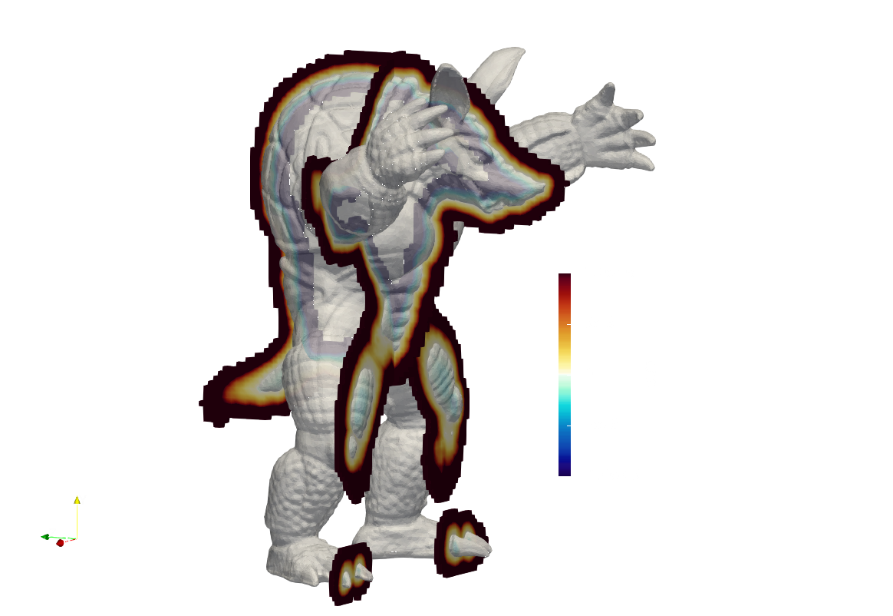

# Signed-Distance-Field
MPI + Fortran based software to compute the signed-distance-field for OBJ file format geometry over cartesian grid. The code assumes regular grid along the streamwise and spanwise directions, while a non-uniform grid can be used in the vertical ($z$) direction.

## How to compile the code

### For small problems - serial CPU version of the code can be used
```
cd src/serial
make
```
### For large problems - MPI version of the code can be used
```
cd src/mpi
make
```

## How to change parameters
Follow the instructions in `parameters.in` to change the input parameters as per requirements

## How to run the code
Edit `parameters.in`
```
# Run the serial code
./gensdf_serial

# Run the MPI code as
mpirun -np 8 ./gensdf_mpi
```


Example output for MPI based job. Note: The elapsed time on the progress bar is indicative and not actual as some MPI ranks may experience a higher computational load compared to the rank that prints the job. MPI rank nprocs/2 prints the progress bar.

```
  ░▒▓██████▓▒░░▒▓████████▓▒░▒▓███████▓▒░ ░▒▓███████▓▒░▒▓███████▓▒░░▒▓████████▓▒░ 
 ░▒▓█▓▒░░▒▓█▓▒░▒▓█▓▒░      ░▒▓█▓▒░░▒▓█▓▒░▒▓█▓▒░      ░▒▓█▓▒░░▒▓█▓▒░▒▓█▓▒░        
 ░▒▓█▓▒░      ░▒▓█▓▒░      ░▒▓█▓▒░░▒▓█▓▒░▒▓█▓▒░      ░▒▓█▓▒░░▒▓█▓▒░▒▓█▓▒░        
 ░▒▓█▓▒▒▓███▓▒░▒▓██████▓▒░ ░▒▓█▓▒░░▒▓█▓▒░░▒▓██████▓▒░░▒▓█▓▒░░▒▓█▓▒░▒▓██████▓▒░   
 ░▒▓█▓▒░░▒▓█▓▒░▒▓█▓▒░      ░▒▓█▓▒░░▒▓█▓▒░      ░▒▓█▓▒░▒▓█▓▒░░▒▓█▓▒░▒▓█▓▒░        
 ░▒▓█▓▒░░▒▓█▓▒░▒▓█▓▒░      ░▒▓█▓▒░░▒▓█▓▒░      ░▒▓█▓▒░▒▓█▓▒░░▒▓█▓▒░▒▓█▓▒░        
  ░▒▓██████▓▒░░▒▓████████▓▒░▒▓█▓▒░░▒▓█▓▒░▒▓███████▓▒░░▒▓███████▓▒░░▒▓█▓▒░        
  *** Starting with            8 MPI ranks ***
 *** Input file sucessfully read ***
 *** Successfully read the CaNS grid ***
 *** Sucessfully finished setting up the grid spacing ***
 Successfully read OBJ file: data/lucy.obj
 Number of vertices:        49987
 Number of normals:        49987
 Number of faces:        99970
 Geometry is bounded by (minimum)  0.32529841999999998       0.39974423999999997       0.20000000000000001     
 Geometry is bounded by (maximum)  0.67470158000000002       0.60025576000000003       0.80000000000000004     
 *** Min-Max Index-Value pair ***
 Min-Max x:         156  0.30468750000000000      |         355  0.69335937500000000     
 Min-Max y:         195  0.37988281250000000      |         317  0.61816406250000000     
 Min-Max z:          92  0.17871093750000000      |         420  0.81933593750000000     
 -- Finished pre-processing geometry in   0.27099799999999996      seconds...
 - - - - - - - - - - - - - - - - - - - - - - - - - - - - - - - - - - - - - - - - - - - 
 *** Calculating the signed-distance-field | u-faces ***
||||||||||||||||||||||100.00%    99970/   99970 Elapsed:     3.56s Remaining:     0.00s
 *** Writing output data to file ***
 -- Done with file write in   0.23250000000000082      seconds... | u-faces 
 - - - - - - - - - - - - - - - - - - - - - - - - - - - - - - - - - - - - - - - - - - - 
 *** Calculating the signed-distance-field | v-faces ***
||||||||||||||||||||||100.00%    99970/   99970 Elapsed:     3.57s Remaining:     0.00s
 *** Writing output data to file ***
 -- Done with file write in   0.23231200000000030      seconds... | v-faces 
 - - - - - - - - - - - - - - - - - - - - - - - - - - - - - - - - - - - - - - - - - - - 
 *** Calculating the signed-distance-field | w-faces ***
||||||||||||||||||||||100.00%    99970/   99970 Elapsed:     3.56s Remaining:     0.00s
 *** Writing output data to file ***
 -- Done with file write in   0.23273299999999963      seconds... | w-faces 
 - - - - - - - - - - - - - - - - - - - - - - - - - - - - - - - - - - - - - - - - - - - 
 *** Calculating the signed-distance-field | Cell-Center ***
||||||||||||||||||||||100.00%    99970/   99970 Elapsed:     3.57s Remaining:     0.00s
 *** Writing output data to file ***
 -- Done with file write in   0.23209999999999908      seconds... | Cell-Center 
 *** Calculation for SDF completed in    23.869882000000000      seconds ***
```
<center></center>

<center> 
Figure: Comparison of the calculated SDF around the Stanford Armadillo geometry scaled to a smaller size
</center>

## How to visualise the results
1. Use `python/numpy2vtk.py` to convert the `mask.bin` binary file to VTK file to read the data in Paraview/VisIT or other post-processing software
2. Use `python/readmask.py` to directly read the `mask.bin` binary file and plot slices
3. Alternatively, you can also directly parse the binary file in Paraview or VisIT using the `.xmf` file format reader both for constant and variable grid spacing

